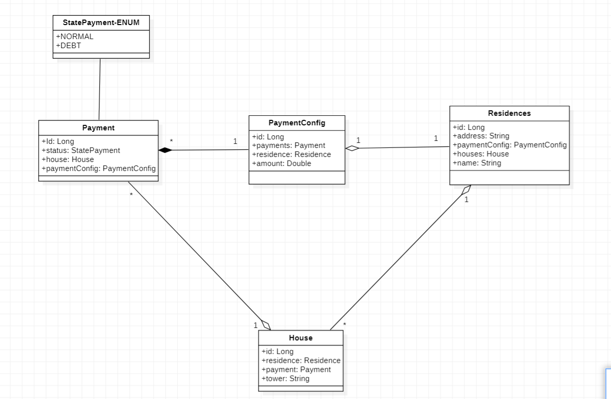

# Backed Develpment - Condominios solution

This is a solution to the [Condominios Problem](https://docs.google.com/document/d/1zzsqkPDKyzaKPqOvgg547dblRVscUKK2/edit?usp=sharing&ouid=113672175879405012923&rtpof=true&sd=true).

## Table of contents

- [Overview](#overview)
  - [The challenge](#the-challenge)
  - [Screenshot](#screenshot)
- [My process](#my-process)
  - [Built with](#built-with)
  - [What I learned](#what-i-learned)
  - [Useful resources](#useful-resources)
- [Acknowledgments](#acknowledgments)

## Overview

### The challenge

Users should be able to:

- We want to develop an application to manage the payment of the administration fee for a group of residential complexes. As backend developers they have been asked to develop an API that allows frontend developers to make their user interfaces dynamic.

### Screenshot
This is the mode that we decide work the relations between the differents entities

## My process

### Built with

- Java
- Spring
- Postgres
- Loombook
- Maven

### What I learned

In this project I had to remember different concepts that I took for granted, so well I got into this and tried my best, I had never worked with Spring so this put me in a little trouble but with help I was able to overcome it, I guess working 100% virtually with my partner via github gave me a better handle on this, I also learned how important it is to know SQL queries.

### Useful resources

- [Resources]
- [https://docs.spring.io/spring-boot/docs/current/reference/htmlsingle/]
- [https://docs.spring.io/spring-data/jpa/docs/current/reference/html/#repositories.query-methods]
- [https://www.youtube.com/watch?v=GaCBrMvgY2A]

## Acknowledgments

Well Santiago... that man, I really appreciate him, without him I... I couldn't have done this, he really helped me and stayed there for me, he really gave me good advice for programming and encouraged me to keep giving my best.

